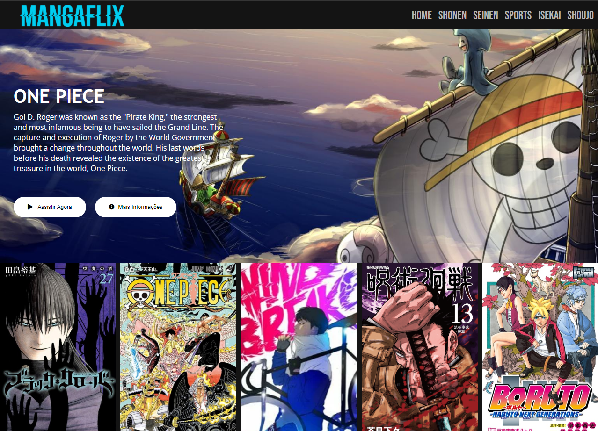
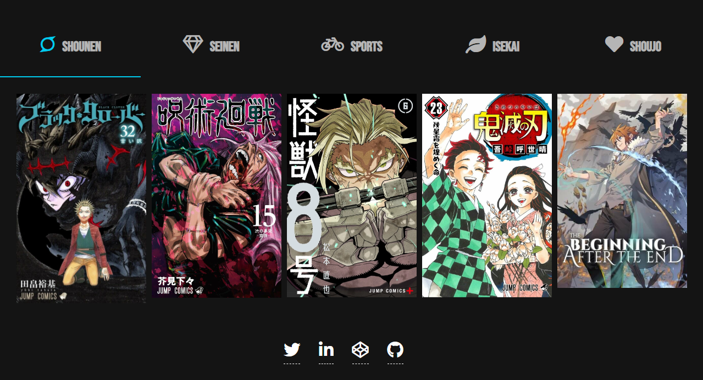

  

COVER NETFLIX PAGE

 

## O Projeto
Bootcamp DIO Carrefour Web Developer - Criando uma interface simples para streaming de mangas com responsividade.

 

## Desafio
Recrie a interface do principal site de streaming mundial utilizando tecnologias simples como HTML5, CSS3 e JavaScript. 

 

## O que foi utilizado:
  * HTML 5
  * CSS 3
  * JAVA SCRIPT
  * OWL CAROUSEL
  * FONT AWESOME
  * FONT GOOGLE

 

## Prints
#

  
   

 

## Responsividade
#

  

  

